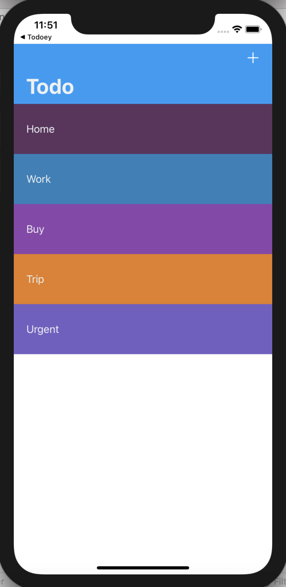
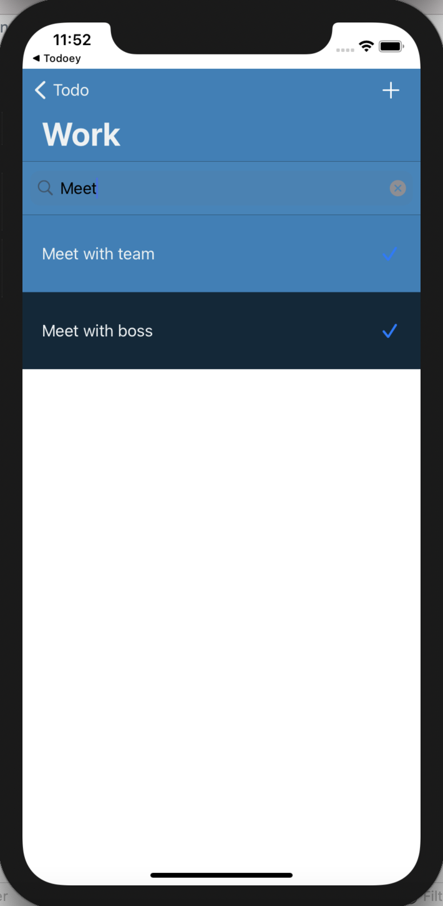
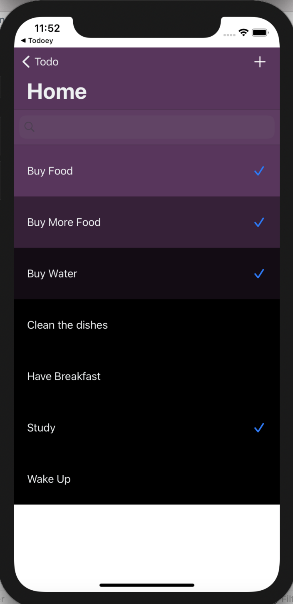
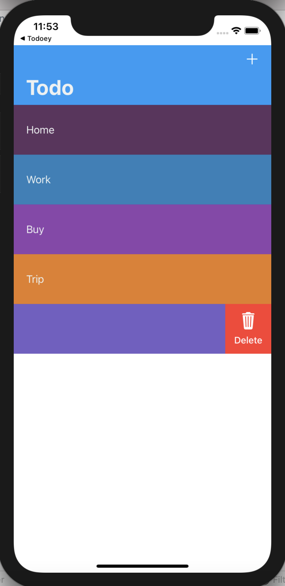

<!--
*** Thanks for checking out the Best-README-Template. If you have a suggestion
*** that would make this better, please fork the repo and create a pull request
*** or simply open an issue with the tag "enhancement".
*** Thanks again! Now go create something AMAZING! :D
-->


<!-- TODO LIST -->
<!--
*** I'm using markdown "reference style" links for readability.
*** Reference links are enclosed in brackets [ ] instead of parentheses ( ).
*** See the bottom of this document for the declaration of the reference variables
*** for contributors-url, forks-url, etc. This is an optional, concise syntax you may use.
*** https://www.markdownguide.org/basic-syntax/#reference-style-links
-->


<!-- PROJECT LOGO -->
<br />
<p align="center">
  

  <h3 align="center">Todo List</h3>

  <p align="center">
    Mobile App com persistencia de dados no Realm.
    <br />
    <a href="https://github.com/victorvieiraveiga/TodoListRealm"><strong>Explore the docs »</strong></a>
    <br />
    <br />
    <a href="https://github.com/victorvieiraveiga/TodoListRealm">View Demo</a>
    ·
    <a href="https://github.com/victorvieiraveiga/TodoListRealm/issues">Report Bug</a>
    ·
</p>


<!-- TABLE OF CONTENTS -->
<details open="open">
  <summary>Indice</summary>
  <ol>
    <li>
      <a href="#about-the-project">Sobre o Projeto</a>
      <ul>
        <li><a href="#built-with">Construido com</a></li>
      </ul>
    </li>
    <li>
      <a href="#getting-started">Começando</a>
      <ul>
        <li><a href="#prerequisites">Pré Requisitos</a></li>
        <li><a href="#installation">Instalação</a></li>
      </ul>
    </li>
    <li><a href="#contact">Contato</a></li>
  </ol>
</details>


<!-- ABOUT THE PROJECT -->
## Sobre o Projeto


Aplicativo Mobile Desenvolvido em Swift. Trata-se de uma Todo List que separa as tarefas por categorias com persistencia utilizando banco de dados REALM. 
Utilizei o repositório CHAMALEON para criar cores aleatorias de backgrounds das categorias e criar cores gradientes na lista de tarefas.

<table>
  <tbody>
    <tr>
      <td>  </td>
      <td>  </td>
      <td>  </td>
      <td>  </td>
    </tr>
  </tbody>
</table>

OBS: Este projeto foi construido como exercicio do curso de iOS da Dra [Angela Yu] (https://www.linkedin.com/in/angela-yu-963a584b/)


### Desenvolvido Com

* [Swift 5.3.1](https://www.apple.com/br/swift/)
* [XCode](https://developer.apple.com/xcode/)
* [Realm](https://realm.io/)
* [CHAMALEON](https://github.com/wowansm/Chameleon)


<!-- GETTING STARTED -->
## Para começar

Baixar ou clonar o repositorio e executar no terminal pod install

### Pré Requisitos

Ter o Xcode com Swift 5.3.1 instalado.
  

### Instalação

1. Get a free API Key at [GitHub](https://github.com/victorvieiraveiga/TodoListRealm)
2. Clone the repo
   ```sh
   git clone https://github.com/victorvieiraveiga/TodoListRealm.git
   ```
3. Install Pod Files
   ```sh
   pod install
   ```


<!-- CONTACT -->
## Contato

Project Link: [https://github.com/your_username/repo_name](https://github.com/victorvieiraveiga/TodoListRealm)


